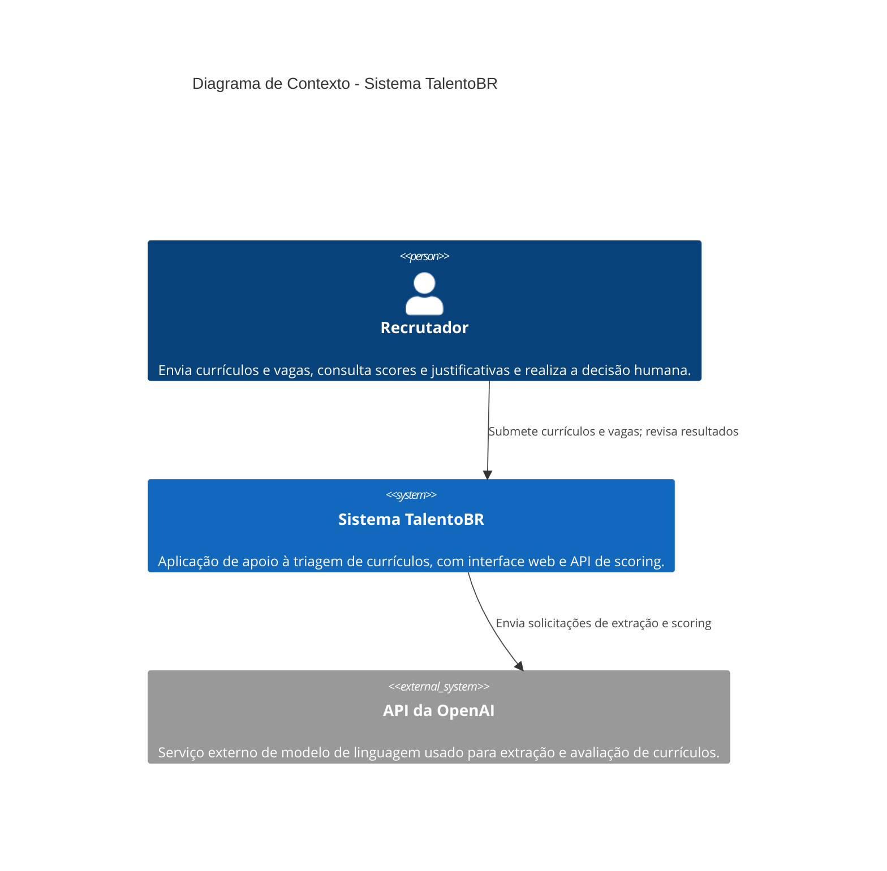
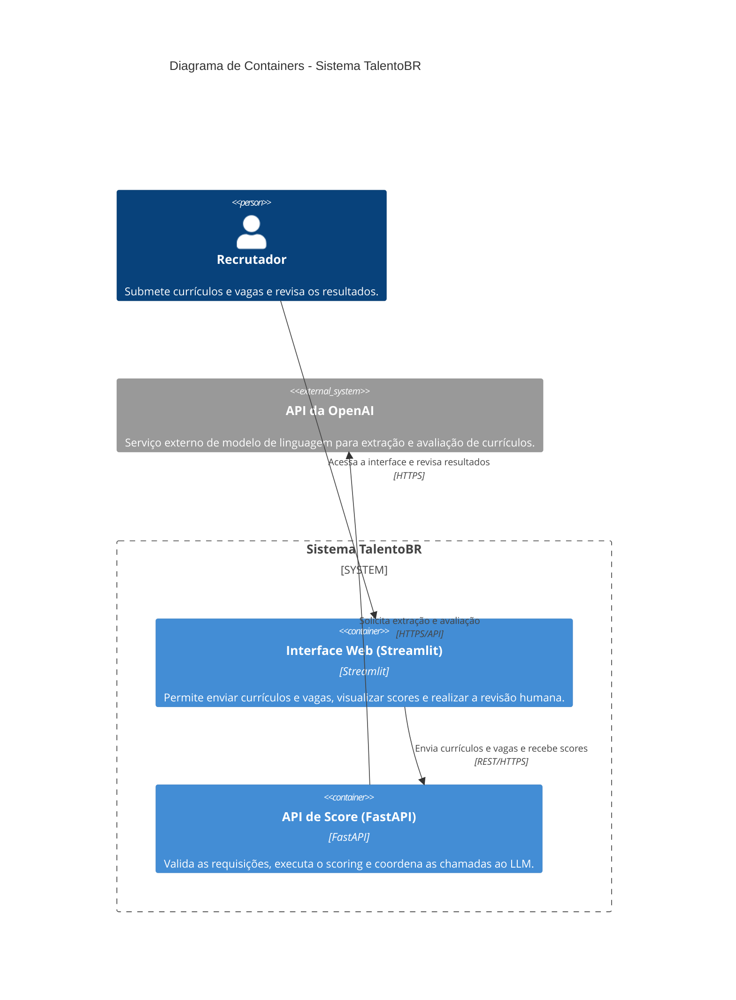

# Arquitetura do TalentoBR

Este documento apresenta o contexto de alto nível do protótipo TalentoBR
seguindo o modelo C4 Nível 1 (Diagrama de Contexto). O recrutador utiliza o
sistema para submeter currículos e vagas, consultar a avaliação e realizar a
revisão humana. O Sistema TalentoBR usa a API da OpenAI para as etapas de
extração e avaliação assistidas por LLM.

## Diagrama C4 Nível 2 (Containers)

O diagrama de containers detalha a decomposição do Sistema TalentoBR em sua
interface de uso e seu backend de scoring. O recrutador acessa a interface
Streamlit via HTTPS. A interface envia os dados da triagem para a API FastAPI
por REST, e a API coordena a extração e a avaliação com a API externa da
OpenAI. O resultado retorna pela mesma cadeia até a interface, onde é
apresentado para revisão humana.

