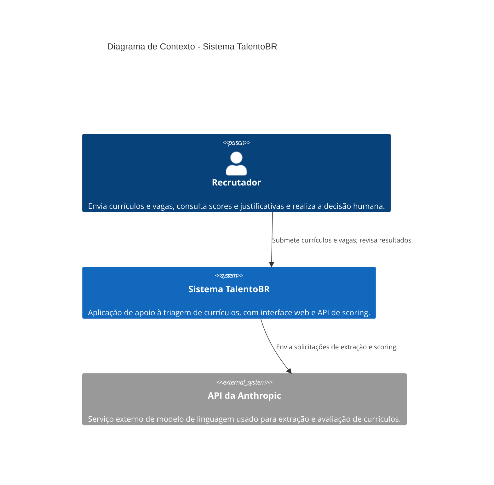
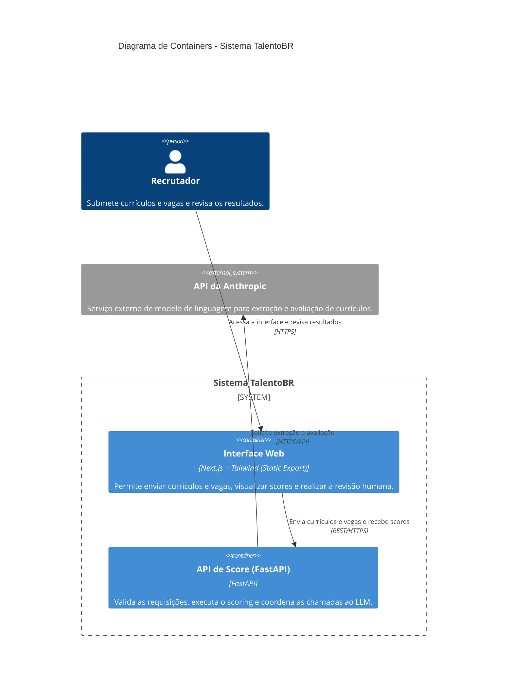

# Arquitetura do TalentoBR

Este documento apresenta o contexto de alto nível do protótipo TalentoBR
seguindo o modelo C4 Nível 1 (Diagrama de Contexto). O recrutador utiliza o
sistema para submeter currículos e vagas, consultar a avaliação e realizar a
revisão humana. O Sistema TalentoBR usa a API da Anthropic para as etapas de
extração e avaliação assistidas por LLM.

```mermaid
C4Context
    title Diagrama de Contexto - Sistema TalentoBR

    Person(recruiter, "Recrutador", "Envia currículos e vagas, consulta scores e justificativas e realiza a decisão humana.")
    System(talentobr, "Sistema TalentoBR", "Aplicação de apoio à triagem de currículos, com interface web e API de scoring.")
    System_Ext(anthropic, "API da Anthropic", "Serviço externo de modelo de linguagem usado para extração e avaliação de currículos.")

    Rel(recruiter, talentobr, "Submete currículos e vagas; revisa resultados")
    Rel(talentobr, anthropic, "Envia solicitações de extração e scoring")
```

## Diagrama C4 Nível 2 (Containers)

O diagrama de containers detalha a decomposição do Sistema TalentoBR em sua
interface web estática e seu backend de scoring. O recrutador acessa a
interface Next.js exportada como arquivos estáticos via HTTPS. A interface
envia os dados da triagem diretamente para a API FastAPI por REST; a API
coordena a extração e avaliação com a API externa da Anthropic. O resultado
retorna pela mesma cadeia até a interface para revisão humana. A API deve
permitir somente as origens web configuradas em `FRONTEND_ORIGINS`.

```mermaid
C4Container
    title Diagrama de Containers - Sistema TalentoBR

    Person(recruiter, "Recrutador", "Submete currículos e vagas e revisa os resultados.")
    System_Boundary(talentobr, "Sistema TalentoBR") {
        Container(web, "Interface Web", "Next.js + Tailwind (Static Export)", "Permite enviar currículos e vagas, visualizar scores e realizar a revisão humana.")
        Container(api, "API de Score (FastAPI)", "FastAPI", "Valida as requisições, executa o scoring e coordena as chamadas ao LLM.")
    }
    System_Ext(anthropic, "API da Anthropic", "Serviço externo de modelo de linguagem para extração e avaliação de currículos.")

    Rel(recruiter, web, "Acessa a interface e revisa resultados", "HTTPS")
    Rel(web, api, "Envia currículos e vagas e recebe scores", "REST/HTTPS")
    Rel(api, anthropic, "Solicita extração e avaliação", "HTTPS/API")
```
