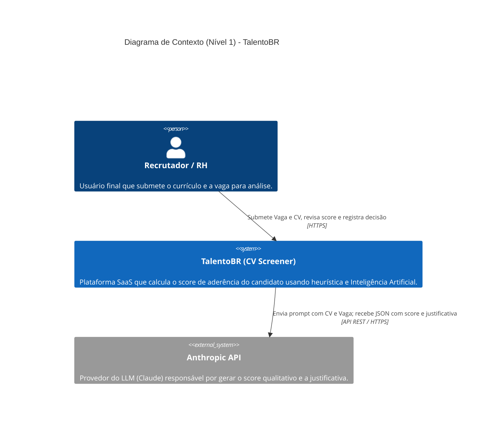
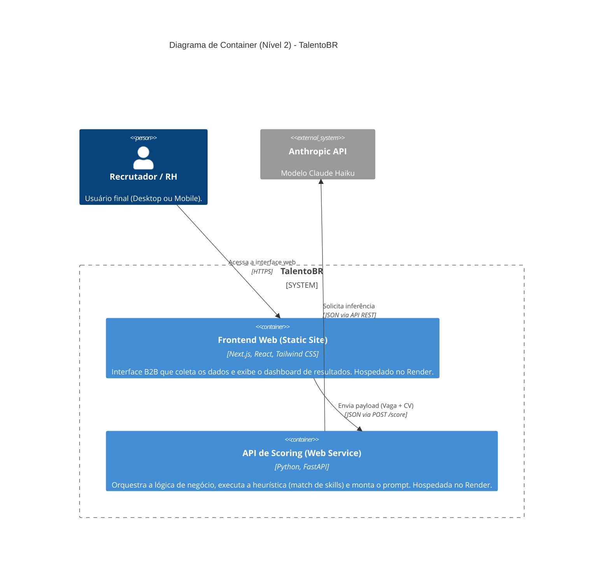

# Diagrama de Arquitetura C4 — TalentoBR

Abaixo estão os diagramas arquiteturais do sistema TalentoBR, mapeando a evolução do protótipo herdado para a arquitetura SaaS baseada na Stack B2.

## Nível 1: Contexto
Mapeia a visão macro do sistema, demonstrando como o usuário interage com a plataforma e quais sistemas externos são consumidos.

```mermaid
C4Context
    title Diagrama de Contexto (Nível 1) - TalentoBR

    Person(recrutador, "Recrutador / RH", "Usuário final que submete o currículo e a vaga para análise.")
    
    System(talento_br, "TalentoBR (CV Screener)", "Plataforma SaaS que calcula o score de aderência do candidato usando heurística e Inteligência Artificial.")
    
    System_Ext(anthropic, "Anthropic API", "Provedor do LLM (Claude) responsável por gerar o score qualitativo e a justificativa.")

    Rel(recrutador, talento_br, "Submete Vaga e CV, revisa score e registra decisão", "HTTPS")
    Rel(talento_br, anthropic, "Envia prompt com CV e Vaga; recebe JSON com score e justificativa", "API REST / HTTPS")
```

```mermaid
    C4Container
    title Diagrama de Container (Nível 2) - TalentoBR

    Person(recrutador, "Recrutador / RH", "Usuário final (Desktop ou Mobile).")

    System_Boundary(talento_br_boundary, "TalentoBR") {
        Container(frontend, "Frontend Web (Static Site)", "Next.js, React, Tailwind CSS", "Interface B2B que coleta os dados e exibe o dashboard de resultados. Hospedado no Render.")
        
        Container(api, "API de Scoring (Web Service)", "Python, FastAPI", "Orquestra a lógica de negócio, executa a heurística (match de skills) e monta o prompt. Hospedada no Render.")
    }

    System_Ext(anthropic, "Anthropic API", "Modelo Claude Haiku")

    Rel(recrutador, frontend, "Acessa a interface web", "HTTPS")
    Rel(frontend, api, "Envia payload (Vaga + CV)", "JSON via POST /score")
    Rel(api, anthropic, "Solicita inferência", "JSON via API REST")

```